## **Acknowledgements**

This project is based on the AddressBook-Level3 project created by the [SE-EDU initiative](https://se-education.org).

### AI Assistance

* Yat Long: AI tools, including Deepseek and Codex, were used to assist with the architecture design and development. This includes making the design pattern more aligned with OOP standard so that code can be reused. They also provide support in building PlantUML diagrams. All suggestion are reviewed before implementing.

* Yong Rui: AI tools, including Codex and Cursor, were used to assist with development and documentation tasks, including refactoring the separate patient, pharmacist, and doctor arrays into a unified person array with role-specific behaviour, and checking affected files for consistency and correctness, which helped resolve several MVP bugs. They also supported the addition of a GitHub Actions workflow to automate PR milestone assignment from linked issues, assisted with PlantUML diagrams, cross-checked documentation against the codebase, refined test cases into valid and invalid partitions, and identified edge cases that could break commands. All suggestions were reviewed and adapted before inclusion.

* Donavan: AI tools (Claude and Copilot) were used to assist with development, bug findings, provide insights on areas of enhancement during Pull Requests reviews. All suggestions were reviewed and adapted before inclusion.

## **Setting up, getting started**

Refer to the guide [_Setting up and getting started_](SettingUp.md).

## **Design**

<div markdown="span" class="alert alert-primary">

💡 **Tip:** The `.puml` files used to create diagrams are in this document `docs/diagrams` folder. Refer to the [_PlantUML Tutorial_ at se-edu/guides](https://se-education.org/guides/tutorials/plantUml.html) to learn how to create and edit diagrams.

</div>

### Architecture


The ***Architecture Diagram*** given above explains the high-level design of the App.

Given below is a quick overview of main components and how they interact with each other.

**Main components of the architecture**

**`Main`** (consisting of classes [`Main`](https://github.com/AY2526S2-CS2103-T11-3/tp/tree/master/src/main/java/seedu/clinic/Main.java) and [`MainApp`](https://github.com/AY2526S2-CS2103-T11-3/tp/tree/master/src/main/java/seedu/clinic/MainApp.java)) is in charge of the app launch and shut down.

* At app launch, it initializes the other components in the correct sequence, and connects them up with each other.
* At shut down, it shuts down the other components and invokes cleanup methods where necessary.

The bulk of the app's work is done by the following four components:

* [**`UI`**](#ui-component): The UI of the App.
* [**`Logic`**](#logic-component): The command executor.
* [**`Model`**](#model-component): Holds the data of the App in memory.
* [**`Storage`**](#storage-component): Reads data from, and writes data to, the hard disk.

[**`Commons`**](#common-classes) represents a collection of classes used by multiple other components.

**How the architecture components interact with each other**

The *Sequence Diagram* below shows how the components interact with each other for the scenario where the user issues the command `delete 1`.

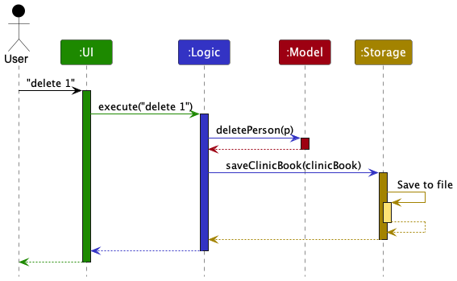

Each of the four main components (also shown in the diagram above),

* defines its *API* in an `interface` with the same name as the Component.
* implements its functionality using a concrete `{Component Name}Manager` class (which follows the corresponding API `interface` mentioned in the previous point.

For example, the `Logic` component defines its API in the `Logic.java` interface and implements its functionality using the `LogicManager.java` class which follows the `Logic` interface. Other components interact with a given component through its interface rather than the concrete class (reason: to prevent outside component's being coupled to the implementation of a component), as illustrated in the (partial) class diagram below.


The sections below give more details of each component.

### UI component

The **API** of this component is specified in [`Ui.java`](https://github.com/AY2526S2-CS2103-T11-3/tp/tree/master/src/main/java/seedu/clinic/ui/Ui.java)


The UI consists of a `MainWindow` that is made up of parts e.g.`CommandBox`, `ResultDisplay`, `PersonListPanel`, `StatusBarFooter` etc. All these, including the `MainWindow`, inherit from the abstract `UiPart` class which captures the commonalities between classes that represent parts of the visible GUI.

The `UI` component uses the JavaFx UI framework. The layout of these UI parts are defined in matching `.fxml` files that are in the `src/main/resources/view` folder. For example, the layout of the [`MainWindow`](https://github.com/AY2526S2-CS2103-T11-3/tp/tree/master/src/main/java/seedu/clinic/ui/MainWindow.java) is specified in [`MainWindow.fxml`](https://github.com/AY2526S2-CS2103-T11-3/tp/tree/master/src/main/resources/view/MainWindow.fxml)

The `UI` component,

* executes user commands using the `Logic` component.
* listens for changes to `Model` data so that the UI can be updated with the modified data.
* keeps a reference to the `Logic` component, because the `UI` relies on the `Logic` to execute commands.
* depends on some classes in the `Model` component, as it displays `Person` object residing in the `Model`.

### Logic component

**API** : [`Logic.java`](https://github.com/AY2526S2-CS2103-T11-3/tp/tree/master/src/main/java/seedu/clinic/logic/Logic.java)

Here's a (partial) class diagram of the `Logic` component:

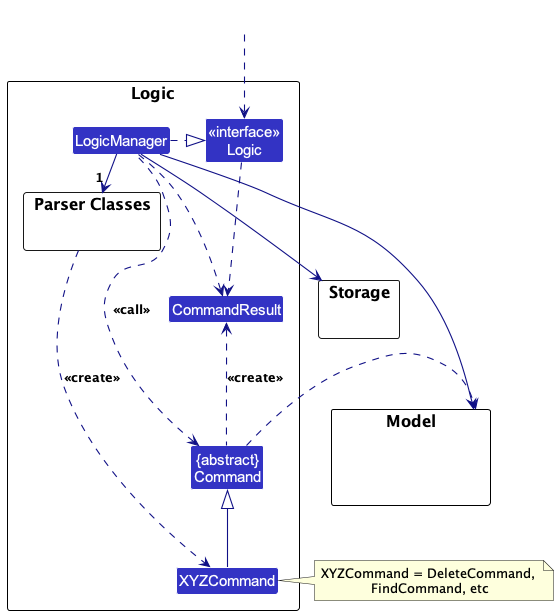

The sequence diagram below illustrates the interactions within the `Logic` component, taking `execute("delete 1")` API call as an example.

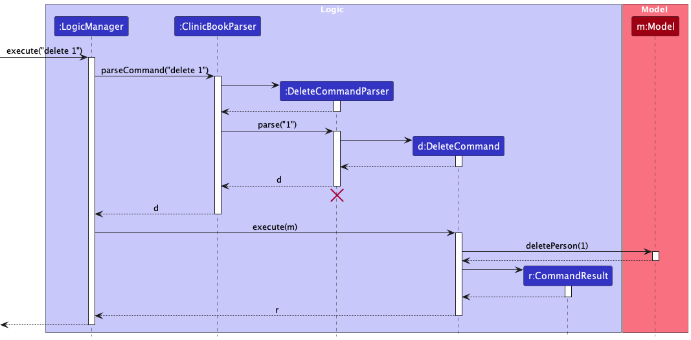

<div markdown="span" class="alert alert-info">:information_source: **Note:** The lifeline for `DeleteCommandParser` should end at the destroy marker (X) but due to a limitation of PlantUML, the lifeline continues until the end of the diagram.
</div>

How the `Logic` component works:

1. When `Logic` is called upon to execute a command, it is passed to a `ClinicBookParser` object which in turn creates a parser that matches the command (e.g., `DeleteCommandParser`) and uses it to parse the command.
2. This results in a `Command` object (more precisely, an object of one of its subclasses, e.g., `DeleteCommand`) which is executed by the `LogicManager`.
3. The command can communicate with the `Model` when it is executed (e.g., to delete a person).<br>
   Note that although this is shown as a single step in the diagram above (for simplicity), in the code it can take several interactions (between the command object and the `Model`) to achieve.
4. The result of the command execution is encapsulated as a `CommandResult` object which is returned from `Logic`.

Here are the other classes in `Logic` (omitted from the class diagram above) that are used for parsing a user command:

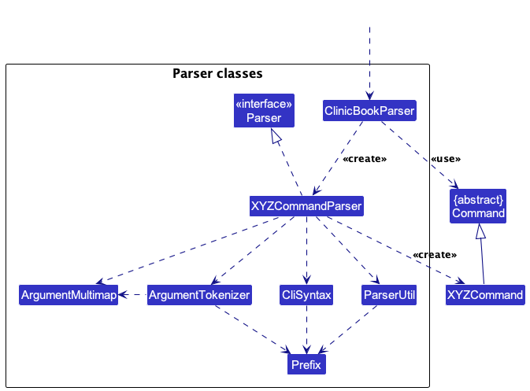

How the parsing works:

* When called upon to parse a user command, the `ClinicBookParser` class creates an `XYZCommandParser` (`XYZ` is a placeholder for the specific command name, e.g., `DeleteCommandParser`) which uses the other classes shown above to parse the user command and create a `XYZCommand` object (e.g., `DeleteCommand`) which the `ClinicBookParser` returns as a `Command` object.
* All `XYZCommandParser` classes (e.g., `DeleteCommandParser`, `FindCommandParser`, ...) inherit from the `Parser` interface so that they can be treated similarly where possible e.g., during testing.

### Model component

**API** : [`Model.java`](https://github.com/AY2526S2-CS2103-T11-3/tp/tree/master/src/main/java/seedu/clinic/model/Model.java)

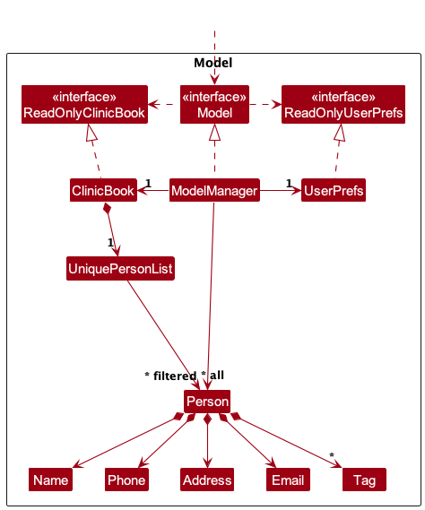

The `Model` component,

* stores the clinic book data, i.e., all `Person` objects (which are contained in a `UniquePersonList` object).
* stores the currently 'selected' `Person` objects (e.g., results of a search query) as a separate _filtered_ list which is exposed to outsiders as an unmodifiable `ObservableList<Person>` that can be 'observed' e.g., the UI can be bound to this list so that the UI automatically updates when the data in the list changes.
* stores a `UserPrefs` object that represents the user's preferences. This is exposed to the outside via the `ReadOnlyUserPrefs` interface.
* does not depend on any of the other three components (as the `Model` represents data entities of the domain, they should make sense on their own without depending on other components)

The class diagram below focuses on the `Person` inheritance hierarchy used by the model.

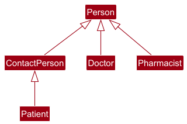

The class diagram below focuses on the `Patient` specialisation and its related value objects.

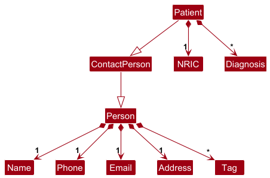

<div markdown="span" class="alert alert-info">:information_source: **Note:** An alternative (arguably, a more OOP) model is given below. It has a `Tag` list in the `ClinicBook`, which `Person` references. This allows `ClinicBook` to only require one `Tag` object per unique tag, instead of each `Person` needing their own `Tag` objects.<br>

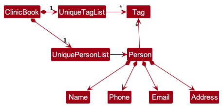

</div>

### Storage component

**API** : [`Storage.java`](https://github.com/AY2526S2-CS2103-T11-3/tp/tree/master/src/main/java/seedu/clinic/storage/Storage.java)

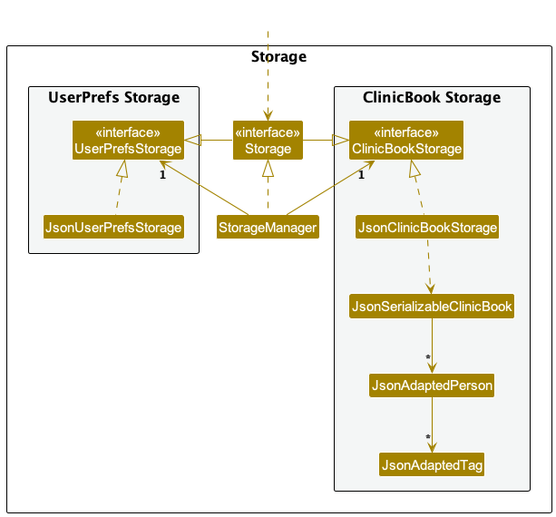

The `Storage` component,

* can save both clinic book data and user preference data in JSON format, and read them back into corresponding objects.
* is defined by the `Storage` interface, which extends both `ClinicBookStorage` and `UserPrefsStorage`. `StorageManager` implements `Storage`, so it can be used where either storage interface is expected.
* depends on some classes in the `Model` component (because the `Storage` component's job is to save/retrieve objects that belong to the `Model`)

### Common classes

Classes used by multiple components are in the `seedu.clinic.commons` package.

## **Implementation**

This section describes some noteworthy details on how certain features are implemented.

### Find command

#### Current Implementation

The `find` command filters ClinicBook's in-memory person list using exactly one prefixed criterion:

* `n/` performs case-insensitive full-word name matching.
* `p/` performs exact phone matching.
* `nric/` performs exact NRIC matching and only matches `Patient` entries.

Unlike AB3's name-only variant, ClinicBook treats `find` as a mode-selected command. This keeps the user-facing
command word stable while still allowing each search mode to share the same filtered-list pipeline.

The sequence diagram below shows the execution flow for `find n/Alice Bob`.

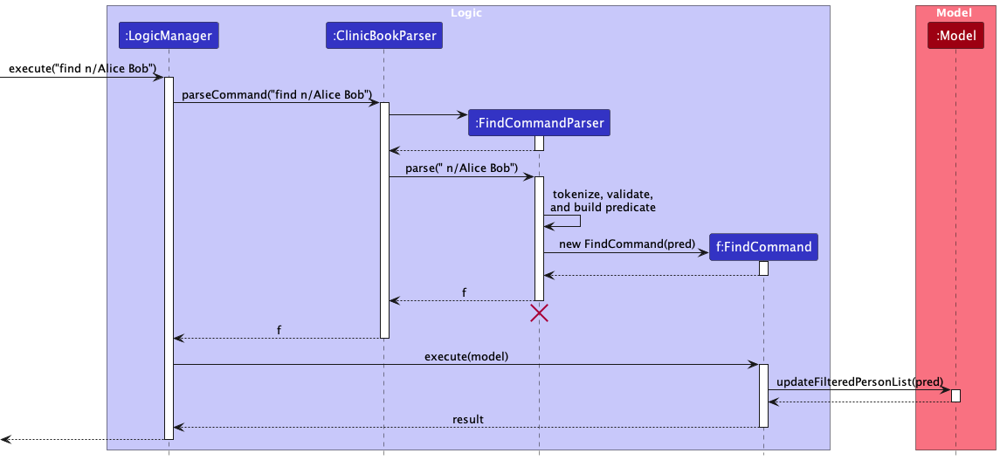

<div markdown="span" class="alert alert-info">:information_source: **Note:** This is a partial sequence diagram. For simplicity, it omits some intermediate objects and lower-level interactions within the `Model` component.</div>

1. `LogicManager` forwards the raw user input to `ClinicBookParser`.
2. `ClinicBookParser` recognises the `find` command word, creates a `FindCommandParser`, and delegates argument parsing to it.
3. `FindCommandParser` validates the selected search criterion and creates a `FindCommand` containing a predicate that
   represents the search criteria.
4. During execution, `FindCommand` passes that predicate to the `Model` component to update the filtered person list.
5. Within the `Model` component, lower-level list-update details are omitted from the diagram; conceptually, the predicate is applied to the filtered person list.

This design is intentionally stateful. Commands that act on the currently displayed list can be chained after
`find` without any extra plumbing, because the filtered list becomes the shared source of truth for follow-up
operations.

#### Parser Validation

The activity diagram below focuses on the parser-side decisions that determine whether a `FindCommand` can be
created.

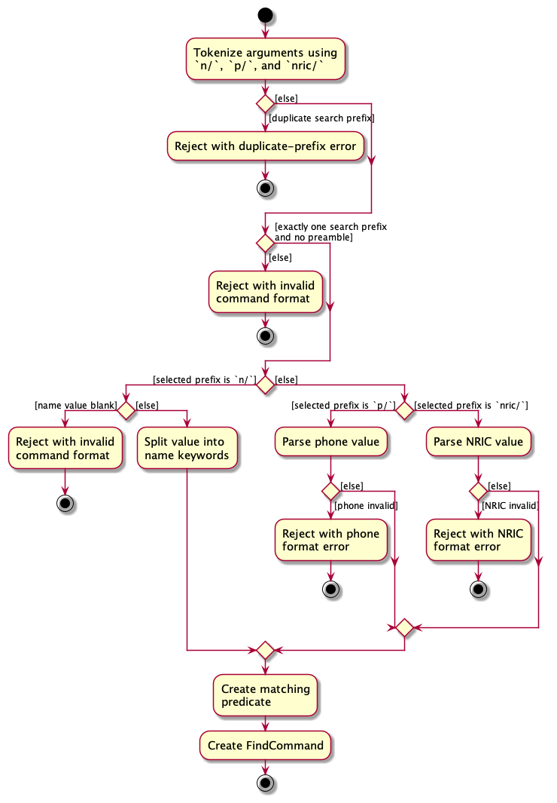

There are four important parser invariants:

* `find Alice` is rejected because unprefixed text is treated as preamble, not a valid search criterion.
* `find n/Alice p/98765432` is rejected because multiple search modes would make matching semantics ambiguous.
* `find n/   ` is rejected even though the prefix is present, because blank name values would otherwise reach the
  word-matching logic and fail later.
* `find n/Alice n/Bob` is rejected with the duplicate-fields error message because repeated single-valued search
  prefixes are rejected before command creation.

This early rejection keeps the execution path simple: once a `FindCommand` is created, its predicate is guaranteed
to contain at least one usable criterion.

#### Matching Semantics

The (partial) class diagram below focuses on `FindCommand`, `PersonMatchesFindCriteriaPredicate`, and the relevant
person hierarchy. Lower-level model implementation details are omitted for simplicity.

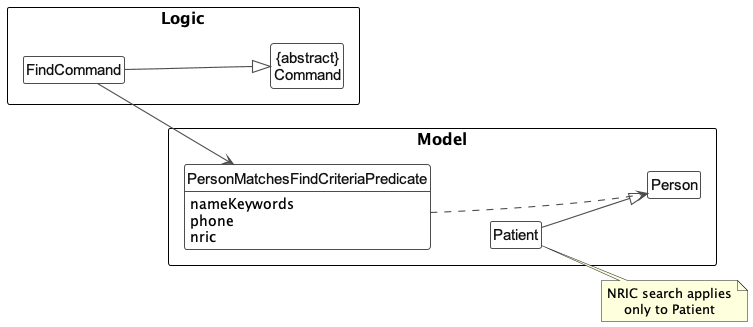

After parsing, `FindCommand` encapsulates a `PersonMatchesFindCriteriaPredicate` that captures the search criteria.
The predicate determines whether each person in the list matches those criteria: name and phone checks apply to any
person, while the NRIC criterion applies only to `Patient` instances. During execution, `FindCommand` passes the predicate to the `Model` component to update the filtered person list.

The patient-only NRIC branch is the most distinctive part of the predicate:

```java
boolean matchesNric = nric.map(value -> person instanceof Patient
        && ((Patient) person).getNric().equals(value)).orElse(true);
return matchesName && matchesPhone && matchesNric;
```

This branch ensures that `find nric/S1234567D` cannot accidentally match a doctor or pharmacist even though all
person subtypes share the same filtered list.

The three matching modes behave differently by design:

* Name search splits the value by whitespace and checks whether **any** keyword matches a full word in the person's
  name. Matching is case-insensitive because it relies on `StringUtil.containsWordIgnoreCase(...)`.
* Phone search delegates parsing to `ParserUtil.parsePhone(...)` and then uses exact equality, so partial numbers do
  not match.
* NRIC search delegates parsing to `ParserUtil.parseNric(...)` and then performs exact equality on `Patient`
  instances only.

Representative scenarios:

* `find n/Alice Bob` returns persons whose names contain either `Alice` or `Bob` as full words.
* `find n/Alice p/98765432` fails fast with the standard invalid-command-format message.
* `find nric/S1234567D` returns only the patient with that NRIC.

The behaviour described above is cross-checked by `FindCommandParserTest`, `FindCommandTest`, and
`PersonMatchesFindCriteriaPredicateTest`.

#### Design Considerations

**Aspect: Command shape**

* **Alternative 1 (current choice):** Keep one `find` command and select the search mode through prefixes.

  * Pros: Preserves one stable command word, one execution path, and one filtered-list workflow for downstream
    commands.
  * Cons: The parser must actively reject invalid multi-prefix combinations.
* **Alternative 2:** Introduce separate commands such as `find-patient` or `find-phone`.

  * Pros: Each command can enforce simpler command-specific rules.
  * Cons: Duplicates command dispatch, documentation, and future extension work.

#### \[Proposed\] Future extension: role-specific filtering

If a future iteration needs subtype-aware narrowing for workflows that mainly target patients, the cleaner extension
is to keep `find` as a single command and add an optional role filter, for example `find role/patient n/Alice`.

Keeping the role filter inside `find` is preferable to introducing `find-patient`, `find-doctor`, and
`find-pharmacist` variants:

* The current parser already centralises all `find` modes in `FindCommandParser`.
* The current predicate already contains subtype-aware logic for NRIC lookups.
* A future `role/` prefix would extend the existing predicate more cleanly than multiplying command words.

### \[Proposed\] Undo/redo feature

#### Proposed Implementation

The proposed undo/redo mechanism is facilitated by `VersionedClinicBook`. It extends `ClinicBook` with an undo/redo history, stored internally as an `clinicBookStateList` and `currentStatePointer`. Additionally, it implements the following operations:

* `VersionedClinicBook#commit()` — Saves the current clinic book state in its history.
* `VersionedClinicBook#undo()` — Restores the previous clinic book state from its history.
* `VersionedClinicBook#redo()` — Restores a previously undone clinic book state from its history.

These operations are exposed in the `Model` interface as `Model#commitClinicBook()`, `Model#undoClinicBook()` and `Model#redoClinicBook()` respectively.

Given below is an example usage scenario and how the undo/redo mechanism behaves at each step.

Step 1. The user launches the application for the first time. The `VersionedClinicBook` will be initialized with the initial clinic book state, and the `currentStatePointer` pointing to that single clinic book state.


Step 2. The user executes `delete 5` command to delete the 5th person in the clinic book. The `delete` command calls `Model#commitClinicBook()`, causing the modified state of the clinic book after the `delete 5` command executes to be saved in the `clinicBookStateList`, and the `currentStatePointer` is shifted to the newly inserted clinic book state.


Step 3. The user executes `add-patient n/David …` to add a new patient. The `add-patient` command also calls `Model#commitClinicBook()`, causing another modified clinic book state to be saved into the `clinicBookStateList`.


<div markdown="span" class="alert alert-info">:information_source: **Note:** If a command fails its execution, it will not call `Model#commitClinicBook()`, so the clinic book state will not be saved into the `clinicBookStateList`.

</div>

Step 4. The user now decides that adding the patient was a mistake, and decides to undo that action by executing the `undo` command. The `undo` command will call `Model#undoClinicBook()`, which will shift the `currentStatePointer` once to the left, pointing it to the previous clinic book state, and restores the clinic book to that state.


<div markdown="span" class="alert alert-info">:information_source: **Note:** If the `currentStatePointer` is at index 0, pointing to the initial ClinicBook state, then there are no previous ClinicBook states to restore. The `undo` command uses `Model#canUndoClinicBook()` to check if this is the case. If so, it will return an error to the user rather
than attempting to perform the undo.

</div>

The following sequence diagram shows how an undo operation goes through the `Logic` component:


<div markdown="span" class="alert alert-info">:information_source: **Note:** The lifeline for `UndoCommand` should end at the destroy marker (X) but due to a limitation of PlantUML, the lifeline reaches the end of diagram.

</div>

Similarly, how an undo operation goes through the `Model` component is shown below:


The `redo` command does the opposite — it calls `Model#redoClinicBook()`, which shifts the `currentStatePointer` once to the right, pointing to the previously undone state, and restores the clinic book to that state.

<div markdown="span" class="alert alert-info">:information_source: **Note:** If the `currentStatePointer` is at index `clinicBookStateList.size() - 1`, pointing to the latest clinic book state, then there are no undone ClinicBook states to restore. The `redo` command uses `Model#canRedoClinicBook()` to check if this is the case. If so, it will return an error to the user rather than attempting to perform the redo.

</div>

Step 5. The user then decides to execute the command `list`. Commands that do not modify the clinic book, such as `list`, will usually not call `Model#commitClinicBook()`, `Model#undoClinicBook()` or `Model#redoClinicBook()`. Thus, the `clinicBookStateList` remains unchanged.


Step 6. The user executes `clear`, which calls `Model#commitClinicBook()`. Since the `currentStatePointer` is not pointing at the end of the `clinicBookStateList`, all clinic book states after the `currentStatePointer` will be purged. Reason: It no longer makes sense to redo the `add-patient n/David …` command. This is the behavior that most modern desktop applications follow.


The following activity diagram summarizes what happens when a user executes a new command:


#### Design considerations:

**Aspect: How undo & redo executes:**

* **Alternative 1 (current choice):** Saves the entire clinic book.

  * Pros: Easy to implement.
  * Cons: May have performance issues in terms of memory usage.
* **Alternative 2:** Individual command knows how to undo/redo by
  itself.

  * Pros: Will use less memory (e.g., for `delete`, just save the person being deleted).
  * Cons: We must ensure that the implementation of each individual command is correct.

## **Documentation, logging, testing, configuration, dev-ops**

* [Documentation guide](Documentation.md)
* [Testing guide](Testing.md)
* [Logging guide](Logging.md)
* [Configuration guide](Configuration.md)
* [DevOps guide](DevOps.md)

## **Appendix: Requirements**

### Product scope

**Target user profile**:

Clinic staff who manage patient and vendor information as part of daily clinic operations

* Registering patients
* Managing contact information (patients, vendors, etc.)
* Retrieving and updating records quickly

**Value proposition**:

- Digitises and reduces paper-based records
- Faster information retrieval
- Reduced human error (illegible handwriting, duplicate entries, etc.)
- Easy to learn and use, designed for staff with basic computer skills
- Lightweight and cost effective (minimal resources and no complex setup)
- Improve data consistency across patient and vendor records
- Support quicker onboarding of new staff

### User stories

Priorities: High (must have) - `* * *`, Medium (nice to have) - `* *`, Low (unlikely to have) - `*`

| Priority  | As a…               | I can…                                                                                                      | So that…                                                                                   |
| --------- | -------------------- | ------------------------------------------------------------------------------------------------------------ | ------------------------------------------------------------------------------------------- |
| `* * `  | Doctor               | Update an existing patient's health information                                                              | I can make medical decisions based on the most current medical history.                     |
| `* * *` | Doctor               | Record an existing patient's symptoms, issue a diagnosis and generate prescriptions with specified dosages   | The patient receives accurate and timely treatment                                          |
| `* * *` | Doctor               | Retrieve an existing patient's medical history                                                               | We can make informed, clinical diagnosis                                                    |
| `* `    | Doctor               | Order lab or imaging tests                                                                                   | We can confirm or refine a diagnosis                                                        |
| `* *`   | Doctor               | Generate a medical certificate for a patient                                                                 | They can formally justify absence from work, school, or other obligations                   |
| `*`     | Doctor               | Generate a specialist referral                                                                               | The patient can receive expert evaluation or treatment for conditions beyond my scope       |
| `*`     | Doctor               | Document any reported side-effects linked to a specific medication and prescription after its administration | Adverse reactions are traceable and clinically actionable                                   |
| `*`     | Doctor               | Retrieve an existing patient's medical records from their caregiver or next-of-kin's name                    | We can access the correct patient records when the patient cannot provide identification    |
| `* `    | Doctor               | Record an existing patient's vital signs                                                                     | Changes in condition can be monitored                                                       |
| `* `    | Doctor               | Log medication administration details                                                                        | Treatment delivery is traceable                                                             |
| `* *`   | Doctor               | Schedule follow-up appointments before discharge                                                             | Continuity of care is maintained                                                            |
| `* * *` | Pharmacist           | Retrieve a patient's health information                                                                      | We can issue the right medication based on the doctor's recommendation                      |
| `* *`   | Pharmacist           | Update a prescription after identifying an incorrect medication or dosage                                    | The patient receives the correct treatment while maintaining a clear audit trail of changes |
| `* *`   | Pharmacist           | Mark a prescription as dispensed                                                                             | Medication fulfillment is fully tracked                                                     |
| `*`     | Pharmacist           | Generate a prescription record for a patient when the medication is unavailable                              | The patient can pick it up from another authorised pharmacy                                 |
| `* * *` | Existing patient     | View my medical records                                                                                      | I can understand my health condition and treatment history                                  |
| `*`     | Existing patient     | Request a refill on my prescription                                                                          | My treatment is not interrupted                                                             |
| `*`     | Existing patient     | Schedule an appointment                                                                                      | I receive timely medical care                                                               |
| `* *`   | Existing patient     | Update my contact information                                                                                | The clinic can reach me whenever necessary                                                  |
| `* *`   | Existing patient     | Grant access to my caregiver or next-of-kin                                                                  | They can assist in managing my healthcare                                                   |
| `* * *` | System Administrator | Purge a patient's record based on data retention policy                                                      | We maintain only the data that is required to operate compliantly                           |
| `* * *` | System Administrator | Register a new patient                                                                                       | The patient can be registered in the system and receive care                                |
| `* * *` | System Administrator | Register a new doctor                                                                                        | They can access the clinic system with the appropriate permissions                          |
| `* * *` | System Administrator | Register a new pharmacist                                                                                    | They can access the clinic system with the appropriate permissions                          |
| `* *`   | Registration staff   | Have phone numbers and IDs auto formatted                                                                    | Data is entered consistently                                                                |
| `* * *` | Registration staff   | Search for an existing patient before creating a new record                                                  | I can avoid creating a duplicated patient record                                            |
| `* * *` | Registration staff   | Search for patients by name, NRIC, or phone number                                                           | I can retrieve records quickly                                                              |
| `*`     | System Administrator | Import a patient medical history from an external clinic after verification                                  | The patient's records are complete and up-to-date                                           |

## MVP User Stories

| Priority  | As a…               | I can…                                                                                                    | So that…                                                           |
| --------- | -------------------- | ---------------------------------------------------------------------------------------------------------- | ------------------------------------------------------------------- |
| `* * *` | Doctor               | Record an existing patient's symptoms, issue a diagnosis and generate prescriptions with specified dosages | The patient receives accurate and timely treatment                  |
| `* * *` | Doctor / Pharmacist  | Retrieve an existing patient's medical history                                                             | We can make informed, clinical diagnosis                            |
| `* * *` | System Administrator | Purge a patient's record based on data retention policy                                                    | We maintain only the data that is required to operate compliantly   |
| `* * *` | System Administrator | Register a new patient                                                                                     | The patient can be registered in the system and receive care        |
| `* * *` | System Administrator | Register a new doctor                                                                                      | They can access the clinic system with the appropriate permissions. |
| `* * *` | System Administrator | Register a new pharmacist                                                                                  | They can access the clinic system with the appropriate permissions. |
| `* * *` | Registration staff   | Search for patients by name, NRIC, or phone number                                                         | I can retrieve records quickly                                      |

### Use cases

(For all use cases below, the **System** is the `ClinicBook` and the **Actor** is the `user`, unless specified otherwise)

**Use case: UC1 - Add New Patient Record**

**MSS**

1. User requests to add a new patient.
2. ClinicBook requests for patient details.
3. User enters the patient's details.
4. User submits the details.
5. ClinicBook shows the details for confirmation.
6. User confirms.
7. ClinicBook adds the record.
   Use case ends.

**Extensions**

* 4a. ClinicBook finds a duplicate record with the same NRIC

  * 4a1. ClinicBook shows the potential duplicate record.
  * Use case ends.
* 4b. ClinicBook finds a duplicate record with the same name or phone number

  * 4b1. ClinicBook shows the potential duplicate record.
  * 4b2. ClinicBook requests for confirmation.
  * 4b3. User amends if needed.
  * 4b4. User confirms.
  * Use case resumes at Step 7.
* 4c. Invalid input

  * 4c1. ClinicBook shows an error message indicating a correct input format.
  * Use case resumes at Step 2.
* 5a. User wants to edit

  * 5a1. User retracts the submission
  * Use case resumes at Step 2
* 5b. User doesn't want to add this record anymore

  * 5b1. User cancels the submission
  * Use case ends.

**Use case: UC2 - Get Patient's Medical History**

**MSS**

1. User requests to view patient's medical history.
2. ClinicBook requests for patient's information, NRIC / name.
3. User provides patient's NRIC / Name.
4. ClinicBook shows the medical history of this user.
   Use case ends.

**Extensions**

* 2a. ClinicBook cannot find the record

  * 2a1. ClinicBook notifies the user that no records were found.
    Use case ends.
* 3a. The patient's NRIC / Name is invalid.

  * 3a1. ClinicBook shows an error message.
    Use case resumes at step 2.

**Use case: UC3 - Create patient diagnosis and prescription**

**Actor:** Doctor

**Preconditions:** Doctor is logged in; UC2 returns a valid patient record

**MSS**

1. Doctor `<u>`gets a patient's medical history (UC2)`</u>`
2. Doctor requests to create a new diagnosis
3. ClinicBook requests for diagnosis details
4. Doctor enters diagnosis, prescription details
5. ClinicBook requests for confirmation on recording of diagnosis, prescription
6. Doctor confirms
7. ClinicBook adds new diagnosis, prescription

Use case ends.

**Extensions**

* 4a. The diagnosis field is empty
  4a1. ClinicBook requests for a diagnosis and prescription
  4a2. Doctor enters data for the missing fields
  Steps 4a1 - 4a2 are repeated until the missing fields are filled
  Use case resumes at step 5
* *a. At any time, doctor chooses to cancel the diagnosis logging
  *a1. ClinicBook requests to confirm cancellation.
  *a2. Doctor confirms
  Use case ends.

**Use case: UC4 - Register a new doctor**

**Actor:** System Administrator

**Preconditions:** System Administrator is logged in

**MSS**

1. System Administrator requests to register a new doctor
2. ClinicBook requests for doctor's particulars
3. System Administrator enters doctor's particulars
4. ClinicBook requests for confirmation on registering the new doctor
5. System Administrator confirms
6. ClinicBook registers new doctor
   Use case ends.

**Extensions**

* 3a. At least one of the fields (name, NRIC, contact number) are empty
  3a1. ClinicBook requests for values for these fields
  3a2. System Administrator enters data for the missing fields
  Steps 3a1 - 3a2 are repeated until the missing fields are filled
  Use case resumes at step 4.
* 3b. ClinicBook finds a duplicate doctor with the same NRIC
  3b1. ClinicBook shows the duplicate record
  Use case ends.
* 3c. System Administrator enters invalid input.
* 3c1. ClinicBook shows an error message indicating the correct input format.
* 3c2. System Administrator re-enters the particulars.
  Use case resumes at step 4.
* *a. At any time, System Administrator chooses to cancel the doctor registration
  *a1. ClinicBook requests to confirm cancellation.
  *a2. System Administrator confirms
  Use case ends.

**Use case: UC5 - Search for Patient by Name, NRIC, or Phone Number**

**Actor:** Registration Staff

**Preconditions:** Registration Staff is logged in.

**MSS**

1. Registration Staff requests to search for a patient.
2. ClinicBook requests a search keyword.
3. Registration Staff enters a patient's name, NRIC, or phone number.
4. ClinicBook validates the search keyword.
5. ClinicBook searches for patient records matching the keyword.
6. ClinicBook displays a list of matching patient records.

Use case ends.

**Extensions**

* 3a. Registration Staff enters an empty search keyword.

  * 3a1. ClinicBook shows an error message.
  * 3a2. Registration Staff enters a valid search keyword.
  * Use case resumes at step 4.
* 4a. The search keyword is not in a valid name, NRIC, or phone number format.

  * 4a1. ClinicBook shows an error message.
  * 4a2. Registration Staff enters a valid search keyword.
  * Use case resumes at step 4.
* 5a. No patient records match the search keyword.

  * 5a1. ClinicBook informs Registration Staff that no matching records were found.
  * Use case ends.
* *a. At any time, Registration Staff chooses to cancel the search.

  * *a1. ClinicBook cancels the search request.
  * Use case ends.

**Use case: UC6 - Register a New Pharmacist**

**Actor:** System Administrator

**Preconditions:** System Administrator is logged in.

**MSS**

1. System Administrator requests to register a new pharmacist.
2. ClinicBook requests the pharmacist's particulars.
3. System Administrator enters the pharmacist's particulars.
4. ClinicBook shows the entered particulars for confirmation.
5. System Administrator confirms.
6. ClinicBook registers the new pharmacist.

Use case ends.

**Extensions**

* 3a. At least one of the fields (name, NRIC, contact number) are empty.

  * 3a1. ClinicBook shows an error message indicating the missing fields.
  * 3a2. System Administrator enters the missing information.
    Steps 3a1–3a2 are repeated until all compulsory fields are provided.
    Use case resumes at step 4.
* 3b. ClinicBook detects a duplicate pharmacist record with the same NRIC.

  * 3b1. ClinicBook shows the potential duplicate record.
    Use case ends.
* 3c. System Administrator enters invalid input.

  * 3c1. ClinicBook shows an error message indicating the correct input format.
  * 3c2. System Administrator re-enters the particulars.
    Use case resumes at step 4.
* *a. At any time, System Administrator chooses to cancel the registration.

  * *a1. ClinicBook requests confirmation for cancellation.
  * *a2. System Administrator confirms.
    Use case ends.

**Use case: UC7 - Add Remark to Existing Patient**

**Actor:** Registration Staff

**Preconditions:** Registration Staff is logged in; patient exists in ClinicBook.

**MSS**

1. Registration Staff requests to find a patient by NRIC, name, or phone number.
2. ClinicBook displays matching patient record(s).
3. Registration Staff selects the target patient.
4. Registration Staff requests to add a remark.
5. ClinicBook requests for remark content.
6. Registration Staff enters the remark.
7. ClinicBook shows the updated patient record with the new remark.
8. Registration Staff confirms.
9. ClinicBook saves the updated record.

Use case ends.

**Extensions**

* 2a. No matching patient is found.
  * 2a1. ClinicBook informs Registration Staff that no matching records were found.
  * Use case ends.
* 6a. Remark content is empty or invalid.
  * 6a1. ClinicBook shows an error message and requests valid remark content.
  * 6a2. Registration Staff re-enters remark content.
  * Use case resumes at step 7.
* *a. At any time, Registration Staff cancels the operation.
  * *a1. ClinicBook discards unsaved changes.
  * Use case ends.

**Use case: UC8 - Mark Prescription as Dispensed**

**Actor:** Pharmacist

**Preconditions:** Pharmacist is logged in; patient and prescription records exist.

**MSS**

1. Pharmacist requests to search for a patient by NRIC, name, or phone number.
2. ClinicBook displays matching patient record(s).
3. Pharmacist selects the target patient.
4. ClinicBook displays active prescriptions for the selected patient.
5. Pharmacist chooses a prescription to dispense.
6. ClinicBook requests confirmation to mark the prescription as dispensed.
7. Pharmacist confirms.
8. ClinicBook updates the prescription status to dispensed and records the action.

Use case ends.

**Extensions**

* 2a. No matching patient record is found.
  * 2a1. ClinicBook informs Pharmacist that no matching records were found.
  * Use case ends.
* 4a. Patient has no active prescriptions.
  * 4a1. ClinicBook informs Pharmacist that there are no active prescriptions to dispense.
  * Use case ends.
* 5a. Pharmacist selects an invalid prescription entry.
  * 5a1. ClinicBook shows an error message.
  * 5a2. Pharmacist selects a valid prescription.
  * Use case resumes at step 6.
* *a. At any time, Pharmacist cancels the dispensing operation.
  * *a1. ClinicBook cancels the operation without changing prescription status.
  * Use case ends.

**Use case: UC9 - Search for Existing Patient Before Registration**

**Actor:** Registration Staff

**Preconditions:** Registration Staff is logged in.

**MSS**

1. Registration Staff requests to register a new patient.
2. ClinicBook requests for a search keyword (name, NRIC, or phone number) to check for duplicates.
3. Registration Staff enters the search keyword.
4. ClinicBook displays matching patient record(s), if any.
5. Registration Staff reviews the search result.
6. Registration Staff confirms that no duplicate exists and proceeds with registration.
7. ClinicBook requests for new patient particulars.
8. Registration Staff enters patient particulars.
9. ClinicBook validates and saves the new patient record.

Use case ends.

**Extensions**

* 4a. A duplicate patient record is found.
  * 4a1. ClinicBook shows the duplicate record details.
  * 4a2. Registration Staff cancels the registration.
  * Use case ends.
* 8a. Entered particulars are invalid.
  * 8a1. ClinicBook shows an error message indicating the correct input format.
  * 8a2. Registration Staff re-enters the particulars.
  * Use case resumes at step 9.
* *a. At any time, Registration Staff cancels the operation.
  * *a1. ClinicBook discards the in-progress registration.
  * Use case ends.

**Use case: UC10 - Update Prescription After Medication or Dosage Error**

**Actor:** Pharmacist

**Preconditions:** Pharmacist is logged in; patient and prescription records exist.

**MSS**

1. Pharmacist requests to search for a patient by NRIC, name, or phone number.
2. ClinicBook displays matching patient record(s).
3. Pharmacist selects the target patient.
4. ClinicBook displays the patient's prescription history.
5. Pharmacist selects the prescription that requires correction.
6. Pharmacist requests to update medication and/or dosage details.
7. ClinicBook requests the updated prescription details and reason for change.
8. Pharmacist enters the corrected details.
9. ClinicBook requests confirmation.
10. Pharmacist confirms.
11. ClinicBook updates the prescription and records the change in audit history.

Use case ends.

**Extensions**

* 2a. No matching patient record is found.
  * 2a1. ClinicBook informs Pharmacist that no matching records were found.
  * Use case ends.
* 5a. Selected prescription cannot be edited (e.g., already cancelled).
  * 5a1. ClinicBook informs Pharmacist that the selected prescription cannot be updated.
  * Use case ends.
* 8a. Entered medication or dosage is invalid.
  * 8a1. ClinicBook shows an error message indicating the correct input format.
  * 8a2. Pharmacist re-enters corrected details.
  * Use case resumes at step 9.
* *a. At any time, Pharmacist cancels the update operation.
  * *a1. ClinicBook exits without changing the prescription.
  * Use case ends.

**Use case: UC11 - Purge Patient Record by Data Retention Policy**

**Actor:** System Administrator

**Preconditions:** System Administrator is logged in; target record satisfies retention policy.

**MSS**

1. System Administrator requests to purge a patient record.
2. ClinicBook requests for patient identifier and purge reason.
3. System Administrator enters patient identifier and purge reason.
4. ClinicBook retrieves and displays the patient record with a purge warning.
5. System Administrator confirms the purge action.
6. ClinicBook removes the patient record and related references according to policy.
7. ClinicBook displays a success message and purge log reference.

Use case ends.

**Extensions**

* 4a. Patient record does not exist.
  * 4a1. ClinicBook informs System Administrator that the record was not found.
  * Use case ends.
* 4b. Record does not satisfy retention policy conditions.
  * 4b1. ClinicBook rejects the purge request and displays reason.
  * Use case ends.
* 5a. System Administrator aborts confirmation.
  * 5a1. ClinicBook cancels the purge operation.
  * Use case ends.

**Use case: UC12 - Retrieve Patient Record Through Caregiver or Next-of-Kin**

**Actor:** Doctor

**Preconditions:** Doctor is logged in; caregiver or next-of-kin links are recorded in the system.

**MSS**

1. Doctor requests to find a patient through caregiver or next-of-kin details.
2. ClinicBook requests caregiver/next-of-kin name.
3. Doctor enters caregiver/next-of-kin name.
4. ClinicBook displays linked patient record(s).
5. Doctor selects the target patient record.
6. ClinicBook displays the selected patient's medical history.

Use case ends.

**Extensions**

* 4a. No linked patient records are found.
  * 4a1. ClinicBook informs Doctor that no linked records were found.
  * Use case ends.
* 5a. Doctor selects an invalid record index.
  * 5a1. ClinicBook shows an error message.
  * 5a2. Doctor selects a valid patient record.
  * Use case resumes at step 6.

**Use case: UC13 - Generate Medical Certificate**

**Actor:** Doctor

**Preconditions:** Doctor is logged in; patient's record has been retrieved or selected.

**MSS**

1. Doctor requests to generate a medical certificate for a patient.
2. ClinicBook requests the medical certificate details (date of visit, period of rest, remarks, etc.).
3. Doctor enters the medical certificate details.
4. ClinicBook displays the entered details for confirmation.
5. Doctor confirms the details.
6. ClinicBook generates a medical certificate as a `.pdf` file.
7. ClinicBook displays the generated medical certificate and provides the option to download or print it.

Use case ends.

**Extensions**

* 3a. Doctor enters incomplete medical certificate details.
  * 3a1. ClinicBook shows an error message indicating the missing information.
  * 3a2. Doctor enters the missing details.
  * Steps 3a1–3a2 are repeated until all compulsory fields are provided.
  * Use case resumes at step 4.
* 3b. Doctor enters invalid input (invalid dates, rest period, etc.).
  * 3b1. ClinicBook shows an error message indicating the correct input format.
  * 3b2. Doctor re-enters the medical certificate details.
  * Use case resumes at step 4.
* 6a. ClinicBook fails to generate the medical certificate file.
  * 6a1. ClinicBook shows an error message indicating that the certificate could not be generated.
  * 6a2. Doctor may retry generating the certificate.
  * Use case resumes at step 2.

**Use case: UC14 - Schedule Follow-up Appointment**

**Actor:** Doctor

**Preconditions:** Doctor is logged in; patient's record has been retrieved or selected.

**MSS**

1. Doctor requests to schedule a follow-up appointment for a patient.
2. ClinicBook requests the appointment details (date, time, and notes).
3. Doctor enters the follow-up appointment details.
4. ClinicBook checks the doctor’s schedule for availability.
5. ClinicBook displays the entered appointment details for confirmation.
6. Doctor confirms the appointment.
7. ClinicBook schedules the follow-up appointment and updates the system schedule.
8. ClinicBook displays a confirmation of the scheduled appointment.

Use case ends.

**Extensions:**

* 3a. Doctor enters incomplete appointment details.
  * 3a1. ClinicBook shows an error message indicating the missing fields.
  * 3a2. Doctor enters the missing information.
  * Steps 3a1–3a2 are repeated until all compulsory fields are provided.
  * Use case resumes at step 4.
* 3b. Doctor enters an invalid date or time format.
  * 3b1. ClinicBook shows an error message indicating the correct format.
  * 3b2. Doctor re-enters the appointment details.
  * Use case resumes at step 4.
* 4a. The selected time slot is unavailable.
  * 4a1. ClinicBook informs the Doctor that the selected slot is unavailable.
  * 4a2. Doctor enters a different appointment time.
  * Use case resumes at step 4.

**Use case: UC15 - Schedule Appointment**

**Actor:** Existing Patient

**Preconditions:** Patient is logged in.

**MSS**

1. Patient requests to schedule an appointment.
2. ClinicBook requests the appointment details (preferred doctor, date, and time).
3. Patient enters the appointment details.
4. ClinicBook checks the selected doctor’s availability.
5. ClinicBook displays the entered appointment details for confirmation.
6. Patient confirms the appointment.
7. ClinicBook schedules the appointment and updates the system schedule.
8. ClinicBook displays a confirmation of the scheduled appointment.

Use case ends.

**Extensions:**

* 3a. Patient enters incomplete appointment details.
  * 3a1. ClinicBook shows an error message indicating the missing fields.
  * 3a2. Patient enters the missing information.
  * Steps 3a1–3a2 are repeated until all compulsory fields are provided.
  * Use case resumes at step 4.
* 3b. Patient enters an invalid date or time format.
  * 3b1. ClinicBook shows an error message indicating the correct format.
  * 3b2. Patient re-enters the appointment details.
  * Use case resumes at step 4.
* 4a. The selected time slot is unavailable.
  * 4a1. ClinicBook informs the patient that the selected slot is unavailable.
  * 4a2. Patient selects another available time slot.
  * Use case resumes at step 4.

**Use case: UC16 - Update Contact Information**

**Actor:** Existing Patient

**Preconditions:** Patient is logged in.

**MSS**

1. Patient requests to update their contact information.
2. ClinicBook displays the patient’s current contact information.
3. Patient enters the updated contact information.
4. ClinicBook validates the entered information.
5. ClinicBook displays the updated information for confirmation.
6. Patient confirms the changes.
7. ClinicBook updates the patient’s contact information in the system.
8. ClinicBook displays a confirmation message indicating the update was successful.

Use case ends.

**Extensions:**

* 3a. Patient leaves required fields (e.g., phone number) empty.
  * 3a1. ClinicBook shows an error message indicating the missing fields.
  * 3a2. Patient enters the missing information.
  * Steps 3a1–3a2 are repeated until all compulsory fields are provided.
  * Use case resumes at step 4.
* 3b. Patient enters invalid contact information (e.g., invalid phone number format).
  * 3b1. ClinicBook shows an error message indicating the correct format.
  * 3b2. Patient re-enters the contact information.
  * Use case resumes at step 4.

### Non-Functional Requirements

1. Should work on any _mainstream OS_ as long as it has Java `17` or above installed.
2. Should be able to hold up to 1000 persons without noticeable sluggishness in performance for typical usage.
3. A user with above-average typing speed for regular English text (i.e., not code, not system admin commands) should be able to accomplish most of the tasks faster using commands than using the mouse.
4. All operations should complete within 2 seconds.
5. The system supports only one user accessing the data at a time.
6. Data should persist unless the user deletes the data file.
7. The system should be able to recover gracefully from unexpected shutdowns without data loss for committed transactions.
8. The application should handle invalid or malformed data files without crashing and provide appropriate error messages.
9. The system should enforce role-based access control so that users can only perform actions permitted by their assigned roles (e.g., only System Administrators can register pharmacists).
10. The system should validate user input such as NRIC, phone numbers, and names before storing them to prevent invalid data.
11. The system should record auditable metadata (e.g., user role and timestamp) for high-risk actions such as prescription updates, dispensing, and patient record purge.
12. The system should prevent duplicate patient registration by requiring a pre-registration search check by name, NRIC, or phone number.
13. The system should complete patient search operations within 2 seconds for datasets up to 1000 records under typical clinic usage.

### Glossary

* **Diagnosis**: A medical description of a patient's condition or disease based on symptoms, medical history, and clinical examination
* **Mainstream OS**: Windows, Linux, Unix, MacOS
* **Patient Record**: A record containing a patient's personal information and medical history in ClinicBook.
* **Prescription**: A written order from a doctor specifying medication, dosage, and administration instructions for a patient's treatment
* **Symptom**: Physical or mental signs experienced by a patient that indicate a medical condition or disease
* **Duplicate Record**: A record with the same NRIC / Name / Phone Number
* **Audit Trail**: A chronological record of significant system actions (e.g., prescription changes, dispensing, purge operations), including actor and timestamp.
* **Data Retention Policy**: A rule set defining how long patient data is stored and when records are eligible for purge.
* **Next-of-Kin**: A person designated by a patient for emergency contact and care coordination.
* **NRIC**: National Registration Identity Card number used as a unique identifier for individuals in the system.
* **System User**: Any individual registered in ClinicBook, such as a patient, doctor, or pharmacist.

## **Appendix: Instructions for Manual Testing**

## **Appendix: Effort**

ClinicBook required a higher level of effort compared to AB3. While AB3 manages a single main entity type, ClinicBook manages multiple role-specific person types: patients, doctors, and pharmacists. This increased complexity across the model, commands, validation, storage, UI, and test coverage, as many features needed to preserve shared `Person` behaviour while enforcing role-specific constraints.

The main implementation challenge was redesigning AB3's contact-management workflow into a clinic workflow. Patient records required additional medical data such as NRIC, date of birth, sex, allergies, diagnoses, prescriptions, and lab or imaging test orders. 
Clinical commands such as `diagnosis`, `ordertest`, and `get-history` also required validation across different records. 
For example, the app had to ensure that a diagnosis targets a patient, is diagnosed by a doctor,
and may include prescriptions dispensed by pharmacists. These requirements led to more complex parsing, model operations, and error handling compared to AB3's original name-based contact commands.

A significant amount of effort was saved by reusing AB3 as the project base. AB3 provided the initial JavaFX UI structure, command parsing architecture, JSON storage approach, Gradle setup, testing framework, and documentation structure. This reduced the effort required for general application infrastructure, allowing the team to focus on clinic-specific functionality. The team's adaptation work is reflected especially in the person subtype model, role-specific add commands, diagnosis and prescription handling, lab/imaging test ordering, subtype-aware JSON adapters, and command parsers for clinic workflows.

Despite starting from AB3, ClinicBook achieved a broader domain model and a more integrated workflow. The final product supports registering patients, doctors, and pharmacists, searching by name, phone, or NRIC, recording diagnoses and prescriptions, ordering lab or imaging tests, and retrieving patient history. These features required coordinated changes across the Logic, Model, Storage, UI, testing, and documentation components.

---

## **Appendix: Instructions for Manual Testing**

Given below are instructions to test the app manually.

<div markdown="span" class="alert alert-info">:information_source: **Note:** These instructions only provide a starting point for testers to work on;
testers are expected to do more *exploratory* testing.

</div>

### Launch and shutdown

1. Initial launch

   1. Download the jar file and copy it into an empty folder.
   2. Double-click the jar file.<br>
      Expected: Shows the GUI with a set of sample contacts. The window size may not be optimum.
2. Saving window preferences

   1. Resize the window to an optimum size. Move the window to a different location. Close the window.
   2. Re-launch the app by double-clicking the jar file.<br>
      Expected: The most recent window size and location is retained.

### Finding persons

Prerequisite: Start with the initial sample data from a clean launch, before running commands that add, delete, or clear
records.

1. Test case: `find n/alex lim`<br>
   Expected: Two persons are listed, `Alex Yeoh` and `Jane Lim`.
2. Test case: `find p/98765432`<br>
   Expected: One person is listed, `Lee Mei`.
3. Test case: `find nric/S1234567D`<br>
   Expected: One patient is listed, `Alex Yeoh`.
4. Test case: `find Alex`<br>
   Expected: No person list update is performed. The result display shows an invalid command format message.

### Deleting a person

1. Deleting a person while all persons are being shown

   1. Prerequisites: List all persons using the `list` command. Multiple persons in the list.
   2. Test case: `delete 1`<br>
      Expected: First contact is deleted from the list. Details of the deleted contact are shown in the status message. Timestamp in the status bar is updated.
   3. Test case: `delete 0`<br>
      Expected: No person is deleted. Error details are shown in the status message. Status bar remains the same.
   4. Other incorrect delete commands to try: `delete`, `delete x`, `...` (where x is larger than the list size).<br>
      Expected: Similar to the previous test case.

### Adding a Doctor

1. Adding a Doctor with the same name

   1. Prerequisite: A Doctor with the same name, e.g. `Dr Tom Chan`, is in the ClinicBook.
   2. Test case: `add-doctor n/Dr Tom Chan p/87654321 e/drtan@example.com` Expected: A warning message with the Doctor of the same name is returned. Enter again to add the new record.

