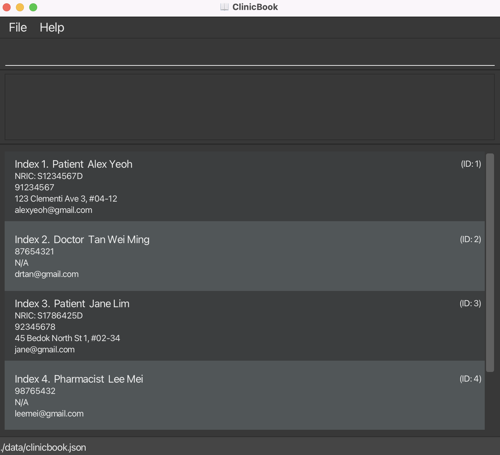

ClinicBook is a **desktop app for managing clinic records, optimized for use via a Command Line Interface** (CLI) while still providing the benefits of a Graphical User Interface (GUI). It supports patient and staff workflows such as adding records, reviewing medical history, and recording diagnoses.

* Table of Contents
{:toc}

--------------------------------------------------------------------------------------------------------------------

## Quick start

1. Ensure you have Java `17` or above installed in your Computer. 
   **Mac users:** Ensure you have the precise JDK version prescribed [here](https://se-education.org/guides/tutorials/javaInstallationMac.html).  
   **Windows users:** Ensure you have the precise JDK version prescribed [here](https://se-education.org/guides/tutorials/javaInstallationWindows.html).  
   **Linux users:** Ensure you have the precise JDK version prescribed [here](https://se-education.org/guides/tutorials/javaInstallationLinux.html).

1. Download the latest `.jar` file from [here](https://github.com/AY2526S2-CS2103-T11-3/tp/releases).

1. Copy the file to the folder you want to use as the _home folder_ for your ClinicBook.

1. Open a command terminal, `cd` into the folder you put the jar file in, and use the `java -jar JAR_FILE_NAME.jar` command to run the application, replacing `JAR_FILE_NAME.jar` with the name of the downloaded jar file. For example, if the file is named `clinicbook.jar`, use `java -jar clinicbook.jar`. 
   A GUI similar to the below should appear in a few seconds. Note how the app contains some sample data. 
   

1. Type the command in the command box and press Enter to execute it. e.g. typing **`help`** and pressing Enter will open the help window. 
   Some example commands you can try:

   * `list` : Lists all patient and staff records.

   * `find n/Alice` : Finds persons whose names match the keyword.

   * `add-doctor n/Tan Wei Ming p/87654321 e/drtan@example.com` : Adds a doctor record.

   * `get-history nric/S1234567D` : Retrieves the medical history for the matching patient.

   * `ordertest id/1 test/Blood Test testtype/LAB vd/2026-04-08 ordered/2` : Orders a lab test for patient with ID 1, ordered by doctor with ID 2.

   * `delete 3` : Deletes the 3rd record shown in the current list.

   * `clear` : Deletes all records.

   * `exit` : Exits the app.

1. Refer to the [Features](#features) below for details of each command.

--------------------------------------------------------------------------------------------------------------------

## Features

**:information_source: Notes about the command format:** 

* Words in `UPPER_CASE` are the parameters to be supplied by the user. 
  e.g. in `find n/NAME_KEYWORDS`, `NAME_KEYWORDS` is a parameter which can be used as `find n/John`.

* Items in square brackets are optional. 
  e.g. `add-patient n/NAME nric/NRIC dob/DOB sex/SEX [allergy/ALLERGY]... e/EMAIL p/PHONE a/ADDRESS`
  can be used with or without any `allergy/` values.

* Items with `…`​ after them can be used multiple times including zero times. 
  e.g. `allergy/Penicillin allergy/Peanuts` or `sym/fever sym/cough`.

* Parameters can be in any order. 
  e.g. if the command specifies `n/NAME p/PHONE e/EMAIL`, `e/EMAIL n/NAME p/PHONE` is also acceptable.

* Confirmation is needed if the user tries to add a new record with a field having the same value.

* Extraneous parameters for commands that do not take in parameters (such as `help`, `list`, `exit` and `clear`) will be ignored. 
  e.g. if the command specifies `help 123`, it will be interpreted as `help`.

* If you are using a PDF version of this document, be careful when copying and pasting commands that span multiple lines as space characters surrounding line-breaks may be omitted when copied over to the application.

### Viewing help : `help`

Shows a message explaining how to access the help page.

Format: `help`

### Listing all persons : `list`

Shows a list of all persons in the clinic book.

Format: `list`

* Each card shows both the displayed index and the person's `ID`.
* Use the displayed index for index-based commands such as `delete`.
* Use the person `ID` for commands that reference a specific person record, such as `diagnosis`.

### Locating persons by name, phone, or NRIC: `find`

Finds persons who match the supplied name keywords, phone number, or patient NRIC.

Format: `find n/NAME_KEYWORDS` or `find p/PHONE` or `find nric/NRIC`

* Prefixes are required. `find Alice` is invalid; use `find n/Alice`.
* Exactly one of `n/`, `p/`, or `nric/` must be provided.
* Name search is case-insensitive. e.g `n/hans` will match `Hans`
* The order of the name keywords does not matter. e.g. `n/Hans Bo` will match `Bo Hans`
* Only full words in the name will be matched e.g. `n/Han` will not match `Hans`
* Phone search requires an exact match. e.g. `p/9876` will not match `98765432`
* NRIC search requires an exact valid NRIC and only matches patient entries.
* Commands with multiple search prefixes are invalid.

Examples:
* `find n/John` returns `john` and `John Doe`
* `find p/98765432` returns persons with phone number `98765432`
* `find nric/S1234567D` returns the patient with NRIC `S1234567D`

### Adding a patient : `add-patient`

Adds a patient to the clinic book.

Format:
`add-patient n/NAME nric/NRIC dob/DOB sex/SEX [allergy/ALLERGY]... e/EMAIL p/PHONE a/ADDRESS`

* `n/`, `nric/`, `dob/`, `sex/`, `e/`, `p/`, and `a/` are required.
* `dob/` must be in `dd-MM-yyyy` format.
* `sex/` must be one of `MALE`, `FEMALE`, or `INTERSEX` (case-insensitive).
* `nric/` must be a valid NRIC and must be unique among patient records.
* `allergy/` is optional and can be repeated.

Example:
`add-patient n/John Doe nric/S1234567D dob/01-01-1990 sex/MALE allergy/Penicillin allergy/Shellfish e/johnd@example.com p/91234567 a/123 Clementi Ave 3, #04-12`

### Adding a doctor : `add-doctor`

Adds a doctor to the clinic book.  
* If a doctor with the same Name / Phone Number / Email is found, confirmation is needed. 
* A doctor cannot be added if an existing doctor has the exact same Name, Phone Number, and Email Address.

Format:
`add-doctor n/NAME p/PHONE e/EMAIL`

* `n/`, `p/`, and `e/` are required.

Example:
`add-doctor n/Tan Wei Ming p/87654321 e/drtan@example.com`

### Adding a pharmacist : `add-pharmacist`

Adds a pharmacist to the clinic book.   
* If a pharmacist with the same Name / Phone Number / Email is found, confirmation is needed.
* A pharmacist cannot be added if an existing pharmacist has the exact same Name, Phone Number, and Email Address.

Format:
`add-pharmacist n/NAME e/EMAIL p/PHONE`

* `n/`, `e/`, and `p/` are required.

Example:
`add-pharmacist n/Lee Mei e/leemei@example.com p/98765432`

### Retrieving a patient's medical history : `get-history`

Retrieves a patient's medical history using the patient's NRIC.

Format:
`get-history nric/NRIC`

* Only `nric/` is accepted by this command.
* `nric/` must be a valid NRIC and is matched exactly against patient records.
* The result includes the patient's details followed by recorded diagnoses, prescriptions, and any ordered lab or imaging tests.

Example:
`get-history nric/S1234567D`

### Deleting a person : `delete`

Deletes the specified person from the clinic book.

Format: `delete INDEX`

* Deletes the person at the specified `INDEX`.
* The index refers to the displayed index shown in the person list, not the ID.
* The index **must be a positive integer** 1, 2, 3, …​

Examples:
* `list` followed by `delete 2` deletes the 2nd person of the list shown on the clinic book.
* `find n/Betsy` followed by `delete 1` deletes the 1st person in the results of the `find` command.

### Adding a diagnosis : `diagnosis`

Adds a diagnosis to a patient and validates the referenced doctor and pharmacist by person `ID`.

Format:
`diagnosis id/PATIENT_ID desc/DESCRIPTION vd/VISIT_DATE diagnosed/DOCTOR_ID sym/SYMPTOM... med/MEDICATION dose/DOSAGE freq/FREQUENCY dispensed/PHARMACIST_ID [med/MEDICATION dose/DOSAGE freq/FREQUENCY dispensed/PHARMACIST_ID]...`

* `id/`, `diagnosed/`, and `dispensed/` use the person `ID` shown on each person card, not the displayed index.
* `id/` must refer to a patient, `diagnosed/` must refer to a doctor, and `dispensed/` must refer to a pharmacist.
* `vd/` must be in `yyyy-MM-dd` format.
* `id/`, `desc/`, `vd/`, and `diagnosed/` are required.
* At least one `sym/` is required.
* At least one complete medication block (`med/`, `dose/`, `freq/`, `dispensed/`) is required.
* To add multiple medications, repeat the full medication block once per prescription.

Example:
`diagnosis id/1 desc/Flu vd/2026-03-01 diagnosed/2 sym/fever sym/cough med/Paracetamol dose/500mg freq/3 times daily dispensed/4`

### Ordering a lab or imaging test : `order-test`

Orders a lab or imaging test for a patient and validates the referenced doctor by person `ID`.

Format:
`order-test id/PATIENT_ID test/TEST_NAME testtype/TEST_TYPE vd/ORDERED_DATE ordered/DOCTOR_ID`

* `id/` and `ordered/` use the person `ID` shown on each person card, not the displayed index.
* `id/` must refer to a patient and `ordered/` must refer to a doctor.
* `testtype/` must be either `LAB` or `IMAGING`.
* `vd/` must be in `yyyy-MM-dd` format.
* Use `order-test` as the command name.
* Both the patient and doctor must already exist in the clinic book.

Example:
`order-test id/1 test/Chest X-Ray testtype/IMAGING vd/2026-04-08 ordered/2`

**:information_source: Viewing ordered tests:**
Ordered tests are saved to the patient's record and can be viewed using `get-history nric/NRIC`.

### Clearing all entries : `clear`

Clears all entries from the clinic book.

Format: `clear`

### Exiting the program : `exit`

Exits the program.

Format: `exit`

### Saving the data

ClinicBook data are saved to the hard disk automatically after any command that changes the data. There is no need to save manually.

### Editing the data file

ClinicBook data are saved automatically as a JSON file `[JAR file location]/data/clinicbook.json`. Advanced users are welcome to update data directly by editing that data file.

:exclamation: **Caution:**
If your changes to the data file make its format invalid, ClinicBook will not be able to load the file and will start with an empty clinic book at the next run. A warning will be shown in the app. If you want to recover existing data, close ClinicBook and fix or restore the data file before entering any commands, as entering commands may overwrite the data file. Hence, it is recommended to take a backup of the file before editing it. 
Furthermore, certain edits can cause the ClinicBook to behave in unexpected ways (e.g., if a value entered is outside of the acceptable range). Therefore, edit the data file only if you are confident that you can update it correctly.

--------------------------------------------------------------------------------------------------------------------

## FAQ

**Q**: How do I transfer my data to another Computer? 
**A**: Install the app in the other computer and overwrite the empty `clinicbook.json` it creates with the file that contains the data of your previous ClinicBook home folder.

--------------------------------------------------------------------------------------------------------------------

## Known issues

1. **When using multiple screens**, if you move the application to a secondary screen, and later switch to using only the primary screen, the GUI will open off-screen. The remedy is to delete the `preferences.json` file created by the application before running the application again.
2. **If you minimize the Help Window** and then run the `help` command (or use the `Help` menu, or the keyboard shortcut `F1`) again, the original Help Window will remain minimized, and no new Help Window will appear. The remedy is to manually restore the minimized Help Window.
3. **Double-clicking the jar file** may not work on some systems. If this happens, open a command terminal, `cd` into the folder you put the jar file in, and use the `java -jar JAR_FILE_NAME.jar` command instead, replacing `JAR_FILE_NAME.jar` with the name of the downloaded jar file. For example, if the file is named `clinicbook.jar`, use `java -jar clinicbook.jar`.
4. **Placing ClinicBook in a write-protected folder** may cause it to not work properly. Use a folder that you have permission to write to.
5. **Mac users using fullscreen mode for secondary dialogs**, such as the Help Window, may encounter unexpected behavior. Avoid using fullscreen mode for these secondary windows.

--------------------------------------------------------------------------------------------------------------------

## Command summary

Action | Format, Examples
--------|------------------
**Add Patient** | `add-patient n/NAME nric/NRIC dob/DOB sex/SEX [allergy/ALLERGY]... e/EMAIL p/PHONE a/ADDRESS`  e.g., `add-patient n/John Doe nric/S1234567D dob/01-01-1990 sex/MALE allergy/Penicillin e/johnd@example.com p/91234567 a/123 Clementi Ave 3, #04-12`
**Add Doctor** | `add-doctor n/NAME p/PHONE e/EMAIL`  e.g., `add-doctor n/Tan Wei Ming p/87654321 e/drtan@example.com`
**Add Pharmacist** | `add-pharmacist n/NAME e/EMAIL p/PHONE`  e.g., `add-pharmacist n/Lee Mei e/leemei@example.com p/98765432`
**Clear** | `clear`
**Delete** | `delete INDEX`  e.g., `delete 3`
**Diagnosis** | `diagnosis id/PATIENT_ID desc/DESCRIPTION vd/VISIT_DATE diagnosed/DOCTOR_ID sym/SYMPTOM... med/MEDICATION dose/DOSAGE freq/FREQUENCY dispensed/PHARMACIST_ID`  e.g., `diagnosis id/1 desc/Flu vd/2026-03-01 diagnosed/2 sym/fever med/Paracetamol dose/500mg freq/3 times daily dispensed/4`
**Order Test** | `order-test id/PATIENT_ID test/TEST_NAME testtype/TEST_TYPE vd/ORDERED_DATE ordered/DOCTOR_ID`  e.g., `order-test id/1 test/Chest X-Ray testtype/IMAGING vd/2026-04-08 ordered/2`
**Find** | `find n/NAME_KEYWORDS` or `find p/PHONE` or `find nric/NRIC`  e.g., `find n/James Jake`
**Get History** | `get-history nric/NRIC`  e.g., `get-history nric/S1234567D`
**List** | `list`
**Help** | `help`
**Exit** | `exit`
